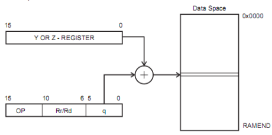

# AVR Assembler 101

Author: Mike Hankey.

Copyright (c) Mike Hankey. All rights reserved.

## Contents

- [AVR Assembler 101](#avr-assembler-101)
  - [Contents](#contents)
  - [Introduction](#introduction)
  - [Memory Configuration](#memory-configuration)
  - [Accessing Memory](#accessing-memory)
    - [Program Memory](#program-memory)
    - [Data Memory](#data-memory)
      - [Data Direct LDS/STS](#data-direct-ldssts)
      - [Data Indirect with Displacement LDD/STD](#data-indirect-with-displacement-lddstd)
      - [Data Indirect LD/ST](#data-indirect-ldst)
      - [Data Indirect with Pre-decrement](#data-indirect-with-pre-decrement)
      - [Data Indirect with Post-increment](#data-indirect-with-post-increment)
    - [EEPROM Memory](#eeprom-memory)
  - [Input/Output](#inputoutput)
  - [The Language](#the-language)
    - [Register Usage](#register-usage)
    - [Macros](#macros)
  - [Mixing Languages](#mixing-languages)
    - [Calling Assembler subroutine from C](#calling-assembler-subroutine-from-c)
    - [Calling C subroutine from Assembler](#calling-c-subroutine-from-assembler)
  - [Complete example assembler program](#complete-example-assembler-program)
  - [Conclusion](#conclusion)
  - [References](#references)
  - [License](#license)

---

In order to learn the assembler programming language some knowledge must be known about the hardware we are using. In this tutorial we will start with a brief introduction to the inner workings of the AVR micro controller then move on to pure assembler and finally show how to mix 'C' and assembler languages.

## Introduction

Why on earth would anyone want to program in a low level language like Assembler when there are languages such as C, C++ and others that provide a layer of abstraction that takes all the drudgery out of programming?

1. Some people are masochists.
2. The code generated by the high level compiler won't fit in MPU's memory space.
3. We have a need for speed.
4. We are control freaks and need to control every aspect of the applications flow.

There is also another good reason to learn assembler, the more you know about the inner workings of the processor the more capable a programmer you will become. And even if you do decide that you need to write portions of your code in Assembler you are not restricted to just using Assmbler or higher level language we can mix them as long as we observe a few simple rules. For instance we could use 'C' as our main language but write the interrupt routines in assembler.

## Memory Configuration

AVR uses a Harvard architecture which is an architecture with separate memories and buses for program and data. Instructions in the program memory are executed with a single level pipelining. This means that while one instruction is being executed, the next instruction is pre-fetched from the program memory. This concept enables most instructions to be executed at every clock cycle. The figure below illustrates the memory map for a typical AVR device. The actual memory configuration will depend on the particular MPU being used, check the data sheet.


## Accessing Memory

Because of the disjointed nature of AVR's architecture each memory segment needs to be accessed in a different fashion. Instructions are provided for program and data memory access and memory can be retrieved or writen in the same way that it is accessed in most other processors. EEPROM access will be covered in it's own section because it is a different beast in Atmel and most other micro controllers.

### Program Memory

Program Memory should be thought of as read only memory hence there are only two instructions for working with it Load Program Memory (LPM) and Store Program Memory (SPM) and unless you are writing self-modifying code there is really no need to write to Program Memory.

### Data Memory

In this section we will cover the many instructions dedicated to working with Data Memory. The information was taken from the ATMega1280 Datasheet since not all processors use these instructions in the same fashion you will need to refer to the Datasheet for the particular processor you are using to be sure these instructions are available on the Microcontroller you are using.

The instructions listed in this section are limited to a 64K data segment and some less but processors that have a larger data space there is a special register, RAMPD that can be used in conjunction with some of the indirect instructiions to access memory beyond the 64K limit. For accessing Program memory above 64K there are also a special registers RAMPX, RAMPY and RAMPZ available.

#### Data Direct LDS/STS

The LDS instruction loads a single byte of data from the data space to a register and depending on whether it uses an 8 or 16 bit address the Opcode size is either 16-bit or 32-bit respectively. Similar instructions are available to transfer a single byte of data from a register to data space using the STS instruction.


```m68k
;Instructions that use this format are;

;LDS - Load Direct from Data Space
;Syntax:
    LDS Rd,k        ;0«d«31, 0«k«65535
;Example:
    LDS R0,0x0100

;LDS (16 bit) - Load Direct from Data Space
;Syntax:
    LDS Rd,k        ;16«d«31, 0«k«127
;Example:
    LDS R16,0x00

;STS - Store Direct to Data Space
;Syntax:
    STS k,Rr        ;0«r«31, 0«k«65535
;Example:
    STS 0x0100,R2

;STS (16 bit) - Store Direct to Data Space
;Syntax:
    STS k,Rr        ;16«r«31, 0«k«127
;Example:
    STS 0x00,R2
```

#### Data Indirect with Displacement LDD/STD

Loads or stores a single byte of data to or from data memory and a register. As can be seen in the image below an immediate value is added to the value in the Y or Z register to derive at the final address of the desired data byte. On devices that have more than 64K data memory area the RAMPY and RAMPZ registers allow for 24-bit addressing.



```m68k
;; LDD - Load Indirect using Y or Z
; Syntax:
    LDD Rd,Y+q    ;0«d«31, 0«q«63
; Example:
    LDD R4,Y+2    ;Load R4 with loc. Y+2

;; STD - Store indirect using Y or Z
; Syntax:
    STD Y+q,Rr    ;0«d«31, 0«q«63
; Example:
   STD Y+2,R4   ;Store R4 at loc. Y+2
```

#### Data Indirect LD/ST

This instruction is similar to the Data Indirect with Displacement except it doesn't use a displacement but instead loads indirectly using the X, Y or Z registers.


```m68k
;; LD - Load Indirect using X, Y or Z
; Syntax:
    LD Rd,X     ;0«d«31
    LD Rd,Y
    LD Rd,Z

; Example:
    LDI R26,0x20
    LD R2,X         ;Load R2 with byte at loc. 0x20
    LDI R28,0x40
    LD R3,Y         ;Load R3 with byte at loc. 0x40
    LDI R30,0x60
    LD R4,Z         ;Load R4 with byte at loc. 0x60
```

#### Data Indirect with Pre-decrement

Similar to the Data Indirect instruction this instruction decrements the X, Y or Z register before the data is accessed and like the Data Indirect instruction it allows the registers to be used.


```m68k
;; LD - Load Indirect using X, Y or Z
; Syntax:
    LD Rd,X     ;0«d«31
    LD Rd,Y
    LD Rd,Z

; Example:
    LDI R26,0x20
    LD R2,-X         ;Load R2 with loc. 0x1F
    LDI R28,0x40
    LD R3,-Y         ;Load R3 with loc. 0x3F
    LDI R30,0x60
    LD R4,-Z         ;Load R4 with loc. 0x5F
```

#### Data Indirect with Post-increment

Similar to the Data Indirect instruction this instruction increments the X, Y or Z register after the data is accessed and like the Data Indirect instruction it allows the registers to be used.


```m68k
;; LD - Load Indirect using X, Y or Z
; Syntax:
    LD Rd,X     ;0«d«31
    LD Rd,Y
    LD Rd,Z

; Example:
    LDI R26,0x20
    LD R2,X+         ;Load R2 with loc. 0x20
    LD R2,X          ;Load R2 with loc. 0x21
    LDI R28,0x40
    LD R3,Y+         ;Load R3 with loc. 0x40
    LD R3,Y          ;Load R3 with loc. 0x41
    LDI R30,0x60
    LD R4,Z+         ;Load R4 with loc. 0x60
    LD R4,Z          ;Load R4 with loc. 0x61
```

### EEPROM Memory

Although the program and data memories are fairly straight forward easy to understand and program, the EEPROM is quite another story. In assembly this is not a trivial pursuit and is better done in 'C' where code is provided that handles the reading and writing of EEPROM.

But for those brave soles that are intent on using assembler to read/write to/from EEPROM I have provided (lifted straight from data sheet) code to perform minimal functionality. Refer to the data sheet for your particular device for further information.

Avoid using the lowest EEPROM address, in some instances this lowest address can be trashed and you will lose your data. Since data is writen in the order you declare your variables just declare a bogus variable before any other.

```m68k
;
;  The EEPROM_Write routine
;
EEPROM_write:
    ;Wait for completion of previous write
    sbic    eecr,eepe
    rjmp    EEPROM_write
    ;Set up the address (r18:r17) to address register
    out     eearh,r18
    out     eearl,r17
    ;Write data (r16) to Data register
    out     eedr,r16
    ;Write logical one to eempe
    sbi     eecr,eempe
    ;Start eeprom write by setting eepe
    sbi     eecr,eepe
    ret

;
;   The EEPROM_Read routine
;
EEPROM_Read:
    ;Wait for the completion of the previous write
    sbic    eecr,eepe
    rjmp    EEPROM_Read
    ;Set up address (r18:r17) in address register
    out     eearh,r18
    out     eearl,r17
    ;Start eeprom read by writing eere
    sbi     eecr,eere
    ;Read data from Data register
    in      r16,eedr
    ret
```

## Input/Output

IO register space is mapped into regular data memory with an offset of 0x20 for most devices meaning that it can be accessed just like any other data memory, this includes the registers for all peripherals such as Timers, USART, Watch Dog Timer, etc..

When used as general I/O ports all ports have read-modify-write functionality and each pin has symmetric capability to drive or sink source. In addition individual pins may be configured as either input or output, have selectable pull-up resistors and have protection diodes to both VCC and GND.

Two special instructions (IN and OUT) are provided for working with I/O registers. An example of how these instructions are used can be viewed in the EEPROM example code.

## The Language

### Register Usage

As a general rule registers used in conjuction with 'C' code follow the general guidelines as listed in the following table. We will be taking a look at these registers when we start mixing languages, they play a very important part in the integration.

|Register|Use|
|--------|---|
|r0|Temporary register - use in interrupts not recommended.|
|r1|Zero register - can be used for temporary data but must be zero'd after use.|
|r18-r27, r30-r31|These are general purpose registers and don't need to be saved when using in conjuction with 'C' code.|
|r2-r17, r28-r29|These are general purpose registers but do need to be saved when using in conjuction with 'C' code.|

### Macros

By definition a macro is a group of instructions that you code once and are able to use as many times as necessary. The main difference between a macro and a subroutine is that the macro is expanded at the place where it is used. A macro can take up to 10 parameters referred to as @0-@9 and given as a comma delimited list.

```m68k
; PUSH_REGS macro
; Example macro that accepts 2 parameters that define the
; registers that are to be pushed onto the stack.
.macro PUSH_REGS
    push    @0
    push    @1
.endmacro

; Then to use the PUSH_REGS macro
label:
    ldi         R18,0x00
    ldi         R17,0x02
    PUSH_REGS   R18,R17

; And in reality what you end up with is
label:
    ldi         R18,0x00
    ldi         R17,0x02
    push        R18     ;macro code
    push        R17     ;macro code
```

Macros are generally made up of code that gets executed on a routine basis and are kept in libraries so that they may be included where and as needed.

## Mixing Languages

The gcc 'C' compiler uses registers in a very consistent manner to pass parameters to and return values from subrountines. If we observe a few simple rules when mixing languages such as 'C' and assembler the integration of the two languages is fairly straight forward. Only 'C' is referenced in this tutorial but I would imagine that many high level languages that use the gcc compiler can be referenced in a similar manner.

When passing parameters to a subroutine Registers r25 through r8, in that order are used. If more parameters then registers need to be passed to the subroutine the stack is used and is not recommended due to a substantial hit to resources. As an additional note register pairs are used regardless of the size of the parameter being passed. This concept and others will be discussed further in the next two sections. Values returned from a subroutine follow the guide lines shown in the following table.

|Register|Size|
|--------|----|
|R24|8 bit values|
|R24-R25|16 bit values|
|R24-R22|32 bit values|
|R24-R18|64 bit values|

### Calling Assembler subroutine from C

By now you should have a pretty good idea of what to expect so I will demonstrate calling an assembly subroutine from 'C' by providing a couple of examples. Each example will have the 'C' code, followed by the resulting disassembled code and finally the assembler subroutine.

In the first example the assembler subroutine adds two 16 bit numbers passed as parameters iParam1 (R25:R24) and iParam2 (R23:R22) and returns the result (R25:R24) to the main 'C' routine.

```c
//Assembly subroutine declaration - keeps the compiler from
//generating a warning concerning implicit declaration.
int AsmSubroutine(int iParam1, int iParam2);

//This is the main 'C' routine
int main()
{
    int iRetVal = 0;

    //Call to our assembler subroutine
    iRetVal = AsmSubroutine(1024, 16);
}
```

Resulting disassembled code

```m68k
;           iRetVal = AsmSubroutine(1024, 16);
318:    80 e0           ldi    r24, 0x00    ; 0
31a:    94 e0           ldi    r25, 0x04    ; 4
31c:    60 e1           ldi    r22, 0x10    ; 16
31e:    70 e0           ldi    r23, 0x00    ; 0
320:    0e 94 ae 01     call    0x35c    ; 0x35c <AsmSubroutine>
324:    90 93 01 06     sts    0x0601, r25
328:    80 93 00 06     sts    0x0600, r24
```

Assembler subroutine code

```m68k
.section    .text

    ; The global directive declares AsmSubroutine as global for linker.
    ; The AsmSubroutine label must follow the global directive.
.global     AsmSubroutine
AsmSubroutine:
    add        R25,R23
    adc        R24,R22
    ret
.end
```

In the second example the assembler subroutine adds two 8 bit numbers passed as parameters iParam1 (R24) and iParam2 (R22) and returns the result (R24) to the main 'C' routine.

```c
//Assembly subroutine declaration - keeps the compiler from
//generating a warning concerning implicit declaration.
unsigned char AsmSubroutine(unsigned char, unsigned char);

//This is the main 'C' routine
int main()
{
    unsigned char ucRetVal = 0;

    //Call to our assembler subroutine
    ucRetVal = AsmSubroutine(32, 16);
}
```

Resulting disassembled code

```m68k
   iRetVal = AsmSubroutine(32, 16);
318:    80 e2           ldi    r24, 0x20    ; 32
31a:    60 e1           ldi    r22, 0x10    ; 16
31c:    0e 94 aa 01     call    0x354    ; 0x354 <AsmSubroutine>
320:    80 93 00 06     sts    0x0600, r24
```

Assembler subroutine code

```m68k
.section    .text

    ; The global directive declares AsmSubroutine as global for linker.
    ; The AsmSubroutine label must follow the global directive.
.global     AsmSubroutine
AsmSubroutine:
    add        R24,R22
    ret
.end
```

As can be seen from the two examples the parameters passed in use a register pair per parameter so in the second example even though we are passing two 8 bit values the compiler puts each 8 bit value in the lower of the register pair.

### Calling C subroutine from Assembler

When calling a 'C' subroutine from assembler the same rules and registers apply, load the proper parameters into R25-R18 and expect the results in the corresponding registers. To illustrate this concept we will add two 16 bit numbers as we did in the first example above but after calling the Assembler subroutine from C we will just make a call to a C routine that will add the two numbers and return the result and as you will see the same results will be obtained.

```c
int AsmSubroutine(int, int);
int AddCSubroutine(int, int);

int main()
{
    int iRetVal = 0;

    iRetVal = AsmSubroutine(1024, 16);
}

//Adds to 16 bit numbers.
int AddCSubroutine(int p1, int p2)
{
    return p1 + p2;
}
```

If you compare this with the first example above you will notice that they are identical.

```m68k
;       iRetVal = AsmSubroutine(1024, 16);
320:    80 e0           ldi    r24, 0x00    ; 0
322:    94 e0           ldi    r25, 0x04    ; 4
324:    60 e1           ldi    r22, 0x10    ; 16
326:    70 e0           ldi    r23, 0x00    ; 0
328:    0e 94 b2 01     call    0x364    ; 0x364 <AsmSubroutine>
32c:    90 93 01 06     sts    0x0601, r25
330:    80 93 00 06     sts    0x0600, r24
```

The assembler subroutine merely calls the 'C' subroutine demonstrating that the same registers are used throughout the process.

```m68k
    .section    .text
    .global     AsmSubroutine
AsmSubroutine:
    call    AddCSubroutine
    ret
    .end
```

## Complete example assembler program

This simple but complete assembler program demonstrates the basic components needed for an assembler application. The application reads data from program memory and writes it in reverse order into data memory demonstrating how the program and data memories are accessed. The example is well commented so no further explanation is provided.

```m68k
/*
    AVR Assembler Tutorial Example

    Author:   Mike Hankey
    Date:     7/17/2010
    Hardware: ATMega1280
    Assembler:AVR Assembler 2.0

    Purpose: Read msg data from program memory and write
    it to Data segment in reverse order.

    Although this is a very simple example of an assmbler
    program it contains many of the elements that are
    needed in most real assembler applications.
*/

.NOLIST
.include "m1280def.inc"
.LIST

/*
    Macro to set the Stack Pointer to end of ram
    Input Parameters: none
*/
.macro SET_STACK
    ldi    r16, LOW(RAMEND)
    out    spl, r16
    ldi    r16, HIGH(RAMEND)
    out    sph, r16
.endmacro

/*
    Data segment
    All we can do here is reserve a    portion of the data
    segment for our target string.  We cannot initialize
    data in this segment. We are setting aside 32 bytes
    (0x20) for our target string.
*/
.dseg
msgd:
    .byte    0x20

/*
    Code Segment
    Use .org to set the base address in code segment where
    we want the code to begin, in this case 0 or beginning
    of the segment.  The first part of the code segment is
    reserved for the interrupt/jump table and the first
    item in the table is the reset vector which we put a
    jump instruction to the first line of our code..  Since
    we are not declaring any other interrupts we can ignore
    the    rest of the table and just add a 2nd .org setting
    the start label or beginning of the    code at location
    0x20.
*/
.cseg
.org 0
    rjmp    start

/*
    End of Jump table and start of our code.
*/
.org 0x20
start:
    SET_STACK            ; Invoke our macro to set stack ptr
    /*
        The Z-resister is used to access Program memory.
        This 16 bit register pair is used as a 16 bit ptr
        to the Program Memory where the most significant 15
        bits select the word address and the LSB is the
        Low/High bit select therefore we must multiply the
        address by 2 by shifting left one place.  We could
        have also have just multiplied by 2;
            ldi    ZH,high(msg*2)
            ldi    ZL,low(msg*2)
        either way is acceptible!
    */
    ldi        ZH,high(msg<<1)     ;Set Z pointer to message
    ldi        ZL,low(msg<<1)
    rcall      get_length          ;call subroutine to get length
    ldi        XH,high(msgd)       ;Set X pointer to destination in
    ldi        XL,low(msgd)        ; data memory.
    add        XL,r17              ;Add count to X pointer,
    /*
        Once we have the length we use it to loop through
        each item loading it into R24, do a post increment
        and write the character to the current location
        pointed to by the X-register pain.  We then
        decrement the X pointer then the counter and if
        not zero branch to loop and repeat.
    */
loop:
    lpm        r24,Z+
    st        X,r24
    dec        XL
    dec        r17
    brge    loop
    ret
/*
    Subroutine to count the length of the string that is
    pointed    to by the Z-register.
        ZH:ZL    Pointer to string
        R17        Calcualted string length
    Upon entry we push the initial value of the Z-register
    for use later.

    We get the length by loading the byte currently pointed
    to by the Z-register and doing a post increment.
    We check the byte and if it is not the terminating zero
    we increment the count and jump to loop to repeat the
    sequence of instructions.

    Upon exit we restore the intial Z-register values.
*/
get_length:
    push    ZH
    push    ZL
    ldi     r17,0
loop1:
    lpm     r24,Z+
    cpi     r24,0
    breq    exit
    inc     r17
    rjmp    loop1
exit:
    pop     ZL
    pop     ZH
    ret
/*
    Our message string...
*/
msg:
    .db        "String to be reversed",0
```

## Conclusion

In this article I have made an attempt to touch on the important aspects of the AVR Assembler language but it is such a broad subject that it would be impossible to cover the entire subject in one setting.

The best way to learn assembler is to go through code and see what others have done or to write a segment of code in C and go into the list file and view the assembler listing. But the bottom line is you have to get your hands dirty.

## References

- [AVR Assembler Tutorial](http://www.avr-asm-tutorial.net/avr_en/index.html) - an overall excellent reference.
- [Beginners Programming in AVR Assembler](http://www.avr-asm-tutorial.net/avr_en/beginner/index.html) - good beginners guide
- [Ruin & Weson Avr assembly optimization](https://web.archive.org/web/20120511173917/http://ruinwesen.com/blog?id=70) - A deeper dive into assembler.

## License

This article, along with any associated source code and files, is licensed under [The Code Project Open License (CPOL)](http://www.codeproject.com/info/cpol10.aspx).
